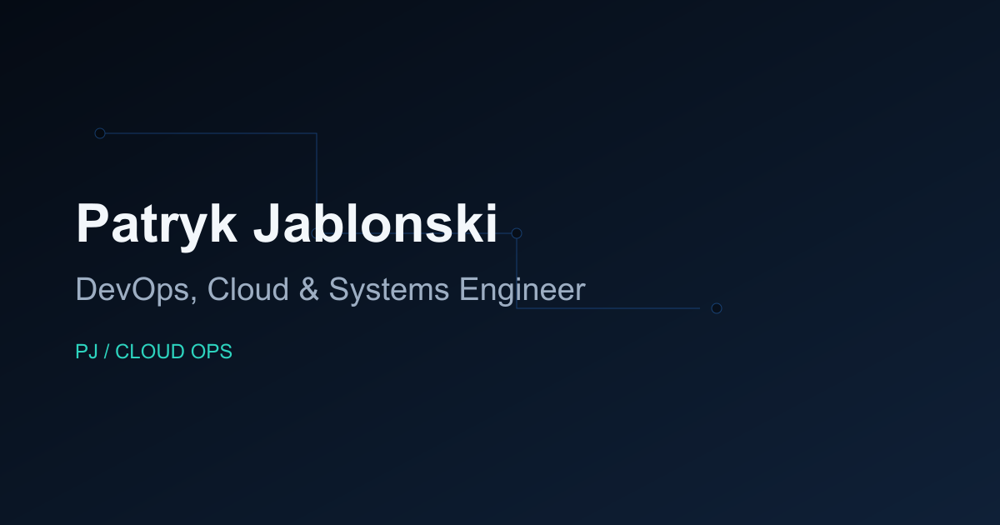

# PJ / Cloud Ops Portfolio



Production URL: https://patrykj369.github.io/

## Overview

A bilingual (PL/EN) Azure-focused portfolio website for Patryk Jabłoński, built as a static React application.

## Features

- Full PL/EN localization with i18next and URL language sharing (`?lang=pl` / `?lang=en`)
- Language persistence in localStorage (`portfolio.language`)
- Semantic one-page architecture with accessible section navigation
- Hero with custom Azure cloud topology visualization
- Data-driven sections for expertise, experience, project case study, and academic profile
- Accessible project gallery modal with keyboard support
- Motion animations with reduced-motion handling
- SEO metadata, Open Graph, canonical, JSON-LD, robots.txt, and sitemap.xml
- CI checks and GitHub Pages deployment workflows

## Tech Stack

- React + TypeScript + Vite
- Tailwind CSS (via `@tailwindcss/vite`)
- Motion for React
- i18next + react-i18next
- Lucide React
- Vitest + React Testing Library
- ESLint + Prettier

## Project Structure

- `src/components`: reusable UI and layout components
- `src/sections`: page sections
- `src/data`: domain data for profile/experience/projects/academic
- `src/i18n`: i18next setup and locale files
- `src/hooks`: reusable hooks (`useLanguage`, `useActiveSection`, `usePrefersReducedMotion`)
- `public`: static assets, metadata files, and project images

## Local Development

```bash
npm install
npm run dev
```

## Quality Commands

```bash
npm run format:check
npm run lint
npm run test:run
npm run build
npm run check
npm audit --audit-level=high
```

## Deployment

- CI workflow: `.github/workflows/ci.yml`
- GitHub Pages workflow: `.github/workflows/deploy-pages.yml`
- GitHub Pages should be configured to use GitHub Actions as source.

## i18n Behavior

Language resolution order:

1. `?lang=pl` or `?lang=en`
2. localStorage (`portfolio.language`)
3. browser language
4. fallback to `pl`

## Adding a New Portfolio Project

1. Add project object in `src/data/projects.ts`.
2. Add translation keys in `src/i18n/locales/pl.json` and `src/i18n/locales/en.json`.
3. Add local images in `public/projects/<project-id>/`.
4. Run `npm run check` and `npm run build`.

## Profile Photo

Expected path for profile photo: `public/images/profile.webp`.

If the file is missing, the app uses `public/images/profile-fallback.svg` automatically.

## Privacy

The public portfolio intentionally does not expose a phone number, email address, contact form, or downloadable full CV. Contact is handled through LinkedIn.

## License

See `LICENSE`.
