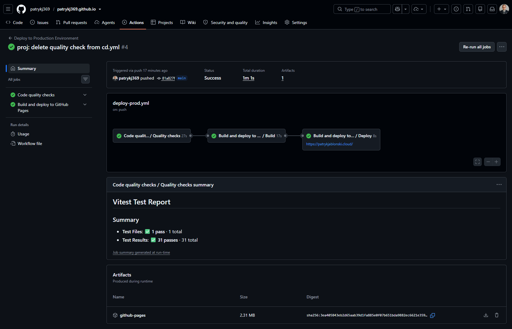

# PJ | DevOps Portfolio


Production URL: https://patrykjablonski.cloud

## Overview

A bilingual (PL/EN) Azure-focused portfolio website for Patryk Jabłoński, built as a static React application.


## Features

- Full PL/EN localization with i18next and URL language sharing (`?lang=pl` / `?lang=en`)
- Language persistence in localStorage (`portfolio.language`)
- Semantic one-page architecture with accessible section navigation
- Hero section with technologies orbit around profile image
- Data-driven sections for expertise, experience, project case study, and academic profile
- Accessible project gallery modal with keyboard support
- Motion animations with reduced-motion handling
- SEO metadata, Open Graph, canonical, JSON-LD, robots.txt, and sitemap.xml
- CI checks and CD GitHub Pages deployment workflows

## Tech Stack

- React + TypeScript + Vite
- Tailwind CSS (via `@tailwindcss/vite`)
- Motion for React
- i18next + react-i18next
- Lucide React
- Vitest + React Testing Library
- ESLint + Prettier

## Project Structure

- `src/components`: reusable UI and layout components
- `src/sections`: page sections
- `src/data`: domain data for profile/experience/projects/academic
- `src/i18n`: i18next setup and locale files
- `src/hooks`: reusable hooks (`useLanguage`, `useActiveSection`, `usePrefersReducedMotion`)
- `public`: static assets, metadata files, and project images

## Local Development

Required runtime: Node.js 24.x (LTS).

```bash
npm ci
npm run dev
```

## Quality Commands

```bash
npm run format:check
npm run lint
npm run test:run
npm run build
npm run check
npm audit --omit=dev --audit-level=high
```

## CI/CD

The project uses GitHub Actions to validate, build, and deploy the application to GitHub Pages.

The production pipeline is defined in `.github/workflows/deploy-prod.yml` and runs automatically after every push to the `main` branch. It can also be started manually using `workflow_dispatch`.

The pipeline is divided into reusable CI and CD workflows:

### Continuous Integration

The CI workflow runs on pull requests and pushes targeting the `main` branch, excluding documentation-only changes. It can also be started manually using `workflow_dispatch`.

The `.github/workflows/ci.yml` workflow performs the following quality checks:

1. Checks out the repository.
2. Configures Node.js 24 with npm caching.
3. Installs dependencies using `npm ci`.
4. Verifies code formatting with Prettier.
5. Runs ESLint.
6. Executes the Vitest test suite.
7. Verifies the production build.
8. Audits production dependencies for high-severity vulnerabilities.

Deployment is blocked if any of these checks fail.

### Continuous Deployment

After the CI workflow completes successfully, `.github/workflows/cd.yml`:

1. Installs dependencies in a clean environment.
2. Creates the production build using Vite.
3. Configures GitHub Pages.
4. Uploads the generated `dist` directory as a deployment artifact.
5. Deploys the artifact to the `github-pages` environment.

The workflow uses GitHub's OIDC token and dedicated Pages permissions. Deployment concurrency is limited to one active GitHub Pages deployment, with older in-progress runs cancelled when a newer commit is pushed.

### Pipeline Status

[](https://github.com/patrykj369/patrykj369.github.io/actions/workflows/deploy-prod.yml)

### Successful Pipeline Run



Production environment: [patrykjablonski.cloud](https://patrykjablonski.cloud)

## i18n Behavior

Language resolution order:

1. `?lang=pl` or `?lang=en`
2. localStorage (`portfolio.language`)
3. browser language
4. fallback to `pl`

## Adding a New Portfolio Project

1. Add project object in `src/data/projects.ts`.
2. Add translation keys in `src/i18n/locales/pl.json` and `src/i18n/locales/en.json`.
3. Add local images in `public/projects/<project-id>/`.
4. Run `npm run check` and `npm run build`.

## Profile Photo

Expected path for profile photo: `public/images/profile.webp`.

If the profile image cannot be loaded, the app displays the `PJ` initials as a fallback.
